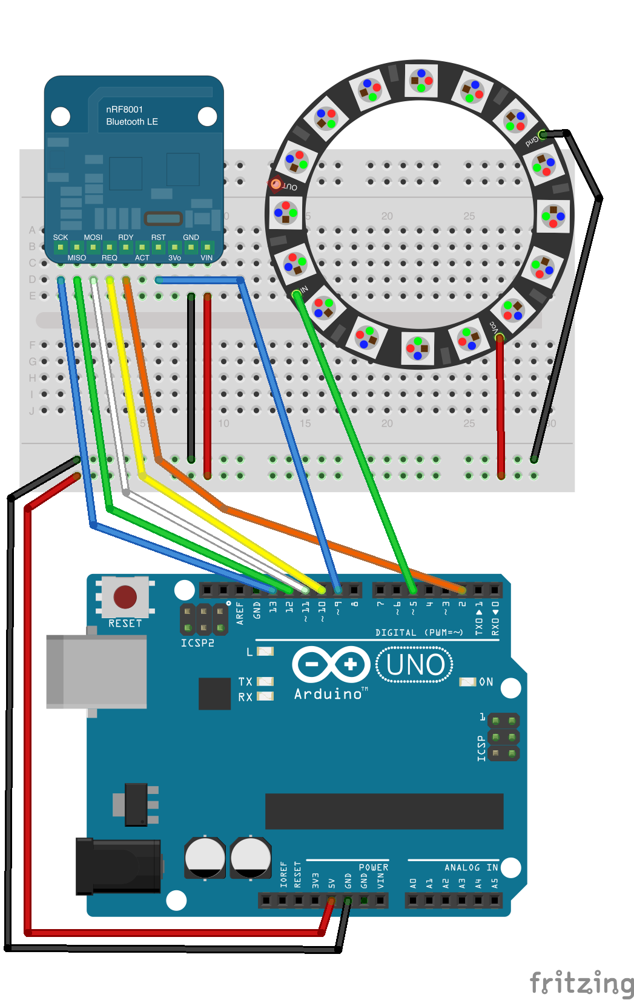

# PhoneGap Arduino LED Example

Control LEDs on the Arduino from your Android Phone.

This is the example code from my [PhoneGap for Makers](http://don.github.io/slides/2013-05-19-phonegap-for-makers/#/) talk at the 2013 Maker Faire Bay Area.

## Arduino

Hardware
 * Arduino Uno
 * [SparkFun Bluetooth Mate Silver](https://www.sparkfun.com/products/10393)
 * [Adafruit NeoPixel Digital RGB LED Weatherproof Strip 60 LED](http://www.adafruit.com/products/1138)

TODO Fritzing diagram here

## Android

### Upload the sketch

Upload the [sketch](https://github.com/don/BluetoothSerial/blob/master/examples/LED/Arduino/PhoneGapLED/PhoneGapLED.ino) to your Uno using the Arduino IDE.

### Pair your phone

Pair your Android phone with the bluetooth adapter.

## PhoneGap - Android

This assumes you have the [Android SDK](http://developer.android.com/sdk/index.html) installed and $ANDROID_HOME/tools and $ANDROID_HOME/platform-tools in your system path.

Adding platforms generates the native project

    $ cordova platform add android
    
Install the Bluetooth Serial plugin with cordova

    $ cordova plugin add cordova-plugin-bluetooth-serial

Connect your phone to the computer.

Compile and run the application

    $ cordova run
    
After the application starts, connect bluetooth by touching the "Connect" label. Occasionally it takes a few times to connect. Watch for the green connect light on the Bluetooth adapter. 

Move the sliders to adjust Red, Green, and Blue values.

## iOS

This code also works with iOS as long as you use a RedBearLabs BLE radio or the Adafruit Bluefruit LE

For the RedBear radios upload the [PhoneGapLED.ino sketch](https://github.com/don/BluetoothSerial/blob/master/examples/LED/Arduino/PhoneGapLED/PhoneGapLED.ino) to your Uno using the Arduino IDE.

For the Adafruit Bluetfruit LE radio upload the [PhoneGapLED_BluefruitLE.ino sketch](https://github.com/don/BluetoothSerial/blob/master/examples/LED/Arduino/PhoneGapLED_BluefruitLE/PhoneGapLED_BluefruitLE.ino) to your Uno using the Arduino IDE.

Adding platforms generates the native project

    $ cordova platform add ios
    
Install the Bluetooth Serial plugin with cordova

    $ cordova plugin add cordova-plugin-bluetooth-serial
    $ cordova prepare
    $ open platforms/ios/LED.xcodeproj
    
Build the code and deploy to your iPhone using Xcode

    

